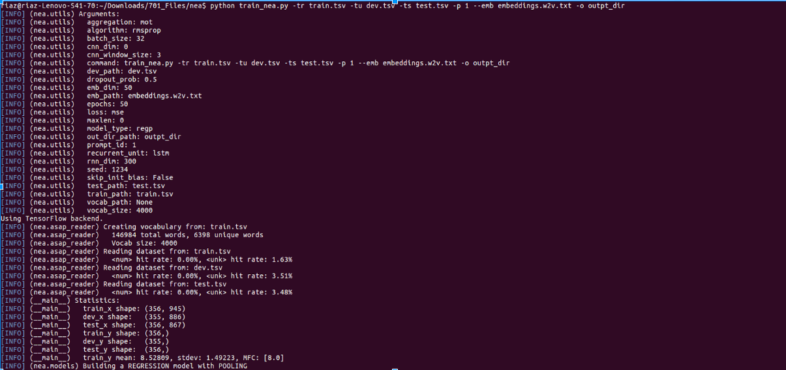

An automatic essay scoring system based on convolutional and recurrent neural networks, including GRU and LSTM.

### Set Up ###

* Install Keras
* Prepare data
* Run train_nea.py

### Data ###

https://www.kaggle.com/c/asap-aes/data

### Run ###

